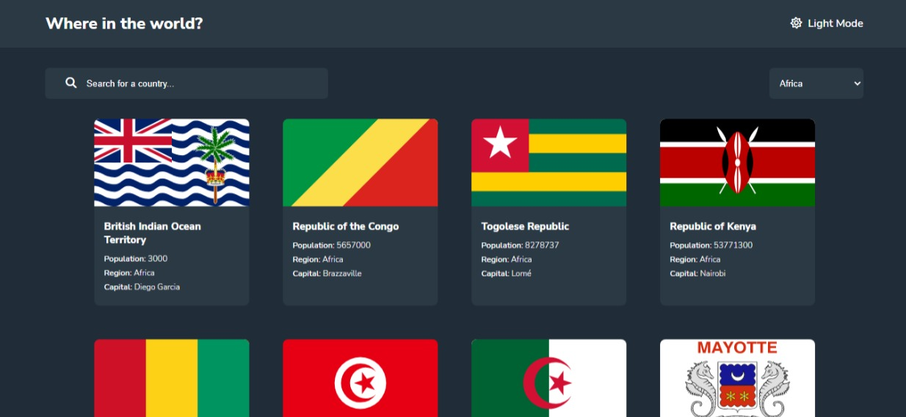

# Frontend Mentor - REST Countries API with color theme switcher solution

This is a solution to the [REST Countries API with color theme switcher challenge on Frontend Mentor](https://www.frontendmentor.io/challenges/rest-countries-api-with-color-theme-switcher-5cacc469fec04111f7b848ca). Frontend Mentor challenges help you improve your coding skills by building realistic projects.

## Table of contents

- [Overview](#overview)
  - [The challenge](#the-challenge)
  - [Screenshot](#screenshot)
  - [Links](#links)
- [My process](#my-process)
  - [Built with](#built-with)
  - [What I learned](#what-i-learned)
  - [Useful resources](#useful-resources)
- [Author](#author)

**Note: Delete this note and update the table of contents based on what sections you keep.**

## Overview

### The challenge

Users should be able to:

- See all countries from the API on the homepage
- Search for a country using an `input` field
- Filter countries by region
- Click on a country to see more detailed information on a separate page
- Click through to the border countries on the detail page
- Toggle the color scheme between light and dark mode _(optional)_

### Screenshot



### Links

- Solution URL: [View Solution](https://www.frontendmentor.io/solutions/worldcountriessearch-LO0snhBx9W)
- Live Site URL: [View Live Demo](https://world-countries-search.vercel.app/)

## My process

### Built with

- Semantic HTML5 markup
- CSS custom properties
- Flexbox
- CSS Grid
- Mobile-first workflow
- [React](https://reactjs.org/) - JS library

### What I learned

I learned to work with react router to create custom routes based on a components id and pass custom states along with it.

To see how you can add code snippets, see below:

```jsx
<Routes>
  <Route path="/" element={<Home viewCountry={viewCountry} />} />
  <Route
    path="countries/:id"
    element={<CountryDetail viewCountry={viewCountry} />}
  />
</Routes>
```

### Useful resources

- [React Router Dom](https://www.jsdocs.io/package/react-router-dom)

## Author

- Website - [Adetoye](https://adetoye.vercel.app)
- Frontend Mentor - [@adetoye-dev](https://www.frontendmentor.io/profile/adetoye-dev)
- Twitter - [@adetoye_dev](https://www.twitter.com/adetoye_dev)
